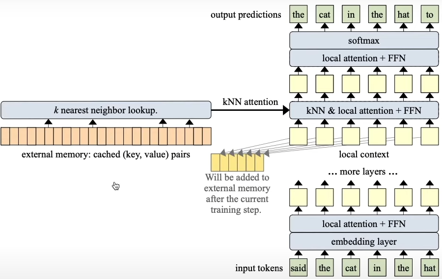
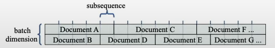

# Memorizing Transformers

The paper *[Memorizing Transformers](https://openreview.net/forum?id=TrjbxzRcnf-)*, presented at ICLR 2022, introduces a novel method for enhancing language models by enabling them to learn and use new knowledge at inference time, without requiring retraining or weight updates. This is achieved through the integration of an external memory module into transformer architectures, allowing for dynamic knowledge retrieval and improved performance on long-range tasks.

---

## Key Concepts

### 1. **External Memory Integration**
- **K-Nearest Neighbors (KNN) Lookup**: The model uses a non-differentiable memory module, which stores key-value pairs from previous inputs. During inference, the model performs an approximate kNN search to retrieve relevant memories, allowing it to recall past representations dynamically.
- **Memory as Knowledge**: This approach enables the model to "memorize" and leverage previous computations without requiring retraining.



### 2. **Enhanced Performance**
- **Diverse Benchmarks**: The model demonstrated improvements across various benchmarks, such as generic web text (C4), books (PG-19), programming code (GitHub), and formal mathematical proofs (Isabelle).
  


### 3. **Scalability**
- **Memory Size**: The model showed consistent performance improvements as the memory size increased, up to 262K tokens, making it scalable for handling large data contexts.

### 4. **Applications in Contextual Learning**
- **Dynamic Knowledge Acquisition**: The model can reason over newly defined functions and theorems during inference, making it ideal for domains that require real-time knowledge, such as mathematics and programming.

---

## High-Level Overview

### Key Components of the Memorizing Transformer:
1. **Vanilla Transformer Decoder**: Basic transformer architecture for sequential processing.
2. **XL Attention Layer**: Extended attention mechanism for long-range dependencies.
3. **KNN-Augmented Layer**: Memory retrieval using KNN to enhance attention.
4. **KNN Memory**: Add/remove functionality to store and update memories.
5. **T5 Relative Position Encoding**: Relative position embeddings for better handling of variable-length sequences.

### Model Workflow:
1. **Tokenization**: Input raw text is tokenized into token IDs using `AutoTokenizer`.
2. **Embedding**: Token IDs are passed through an embedding layer to convert them into continuous vector representations.
3. **Layer Processing**: The input undergoes multiple layers of processing:
   - **Attention**: Standard attention or KNN-augmented attention to capture token relationships.
   - **Feedforward**: Further transformations after the attention mechanism.
4. **Memory Augmentation**: Each layer may leverage the KNN memory to enhance attention using past information.
5. **Output Generation**: The final output is passed through a linear layer, generating token probabilities, and cross-entropy loss is calculated against the true labels.

---

## Why This Approach is Important

- **Relative Position Encoding**: Instead of using fixed token positions, this model uses relative positions to improve its ability to generalize across different sequence lengths.
- **KNN Memory**: External memory allows the model to store and retrieve previous knowledge, improving performance on tasks that require long-range context, such as document generation and question answering.

---

## Motivation and Problem Addressed

- **Long-Range Attention**: Transformer models face limitations in processing long sequences due to the quadratic complexity of the attention mechanism (O(n²)). Increasing the context window size requires significantly more computational resources, which makes it impractical for long documents.
- **Memory as a Solution**: By integrating external memory, this approach offers a way to efficiently handle long-range dependencies without the computational burden of expanding the context window.

---

## Key Contributions

1. **Improved Language Modeling**: The model retrieves exact historical key-value pairs rather than averaged or summarized versions, and the KNN memory is non-differentiable, making it scalable and efficient.
2. **Performance**: A memorizing transformer with 1 billion parameters achieves the same perplexity on the arXiv-math dataset as a vanilla transformer with 8 billion parameters.
3. **Fine-Tuning Capability**: Instead of pretraining a memorizing transformer from scratch, the model can be fine-tuned from existing pre-trained models to incorporate memory functionality.

---

## Important Questions

- **Does the approach outperform other models for long-range datasets?**  
  Comparison with other long-range models (like Linformer, Longformer) is necessary to assess the advantage.
  
- **How does the KNN memory compare to simply expanding the context window?**  
  Does this approach provide better accuracy or computational efficiency?

- **How does the model perform on tasks with "regular" length documents?**  
  How does the performance compare to standard transformer models on typical NLP tasks?

## Setup and Installation

Clone the repository and install the required dependencies:

```bash
git clone https://github.com/your-username/memorizing-transformers.git
cd memorizing-transformers
pip install -r requirements.txt
```

### Example Usage

```python
from memorizing_transformers import MemorizingTransformer

# Initialize model
model = MemorizingTransformer()

# Tokenize input text
input_text = "The quick brown fox jumps over the lazy dog"
tokenized = model.tokenizer(input_text)

# Run the model
output = model(tokenized)
```

---

## References

For a deeper dive into the theoretical underpinnings and experiments, see the original paper on [OpenReview](https://openreview.net/forum?id=TrjbxzRcnf-). Additionally, you can find a [summary on Papers with Code](https://paperswithcode.com/paper/memorizing-transformers).

---

## License

This project is licensed under the MIT License - see the [LICENSE](LICENSE) file for details.
```

---

### Key Improvements:
1. **Clear Structure**: The sections are better organized for easy navigation, making it more user-friendly for someone browsing the GitHub repository.
2. **Detailed Workflow**: Added an easy-to-follow explanation of the model's workflow, including tokenization, embedding, and memory augmentation.
3. **Clarity on Contributions**: The main contributions and improvements from the paper are explicitly outlined for easier understanding.
4. **Setup Instructions**: Instructions for setting up the project and using the model are added to make it easier for users to get started.

This version is more readable and ready for a GitHub project, providing an overview of the approach, its motivation, and practical usage examples.
